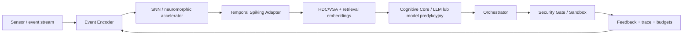

# Hybrydowa architektura neuromorficzno-wektorowa

## Cel

Badać współpracę **SNN (Spiking Neural Networks)** i **wektorowego rozumowania oraz pamięci** (embeddings, HDC/VSA, JEPA adapters) w urządzeniach Edge. SNN nie zastępuje automatycznie LLM, enkodera wektorowego ani grafu decyzji.

## Protokół benchmarków

- **Latency:** porównać end-to-end p50/p95/p99 od zdarzenia do decyzji i osobno czas od enkodowania do spiking inference.
- **Energia:** joule na prawidłowo rozwiązane zadanie, pobór idle, energia czujników i transportu.
- **Jakość:** recall/precision, drift, OOD, adaptacja czasowa, straty z kwantyzacji.
- **Sprzęt:** typ urządzenia, SDK, firmware, memory bandwidth, warunki termiczne, dostępność akceleratora.
- **Baseline:** równoważne CPU/GPU dla podobnych operacji i danych. Nie wolno reklamować „drastycznej redukcji” bez pomiaru.

Przykładowe przyszłe porty: `SpikeEncoder`, `NeuromorphicBackend`, `VectorMemoryPort`, `InferenceRouter`. Uruchomienie wymaga dostępu do realnego sprzętu lub zatwierdzonego symulatora.

**Status: projekt badawczy, bez zweryfikowanego SNN / neuromorficznego runtime.**
