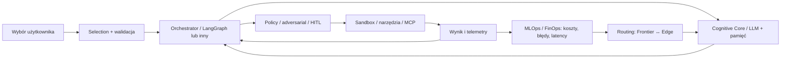

# Diagram przepływu: Cognitive Core ↔ Orchestrator ↔ Sandbox

Przepływ jest **schematem docelowym**, nie dowodem działającej infrastruktury. Jego maszynowo edytowalna wersja to [Cognitive-Core-Orchestrator-Sandbox.mmd](Cognitive-Core-Orchestrator-Sandbox.mmd).

**Dane:** zatwierdzony kontrakt → stan zadania → wnioskowanie → decyzja narzędziowa → brama zabezpieczeń → sandbox → wynik z dowodem → aktualizacja pamięci i telemetrii.

**Kontrola:** brak nieograniczonego wykonywania, jawne uprawnienia, limity czasu/kosztu, brak wynoszenia sekretów, pełny ślad. Warstwy oznaczone jako docelowe wymagają adapterów i testów produkcyjnych.

**Blokada:** ZEUS ma jedynie kontrakt/specyfikację. Diagram nie stanowi polecenia utworzenia Zeusa.
